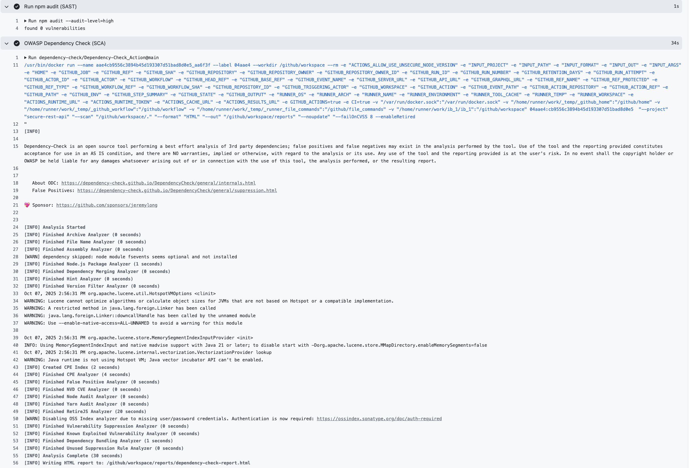
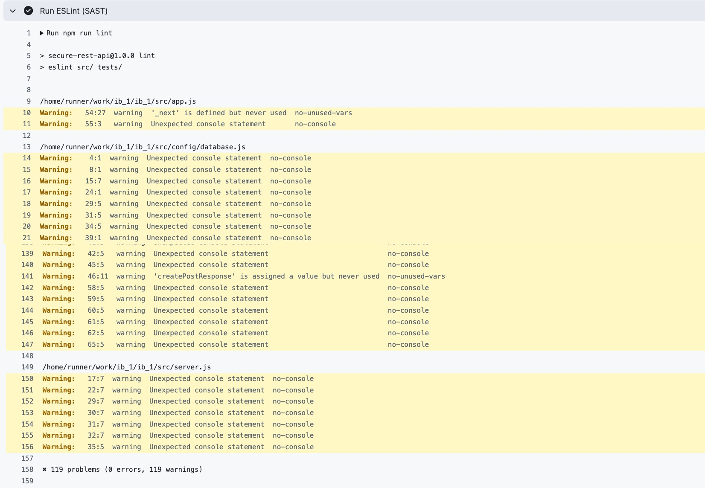

# Защищенное REST API

## Описание проекта

Это защищенное REST API, разработанное в рамках лабораторной работы по безопасности. Проект реализует аутентификацию с использованием JWT, защиту от основных уязвимостей OWASP Top 10 и интегрирован в CI/CD pipeline с использованием инструментов безопасности.

## API Эндпоинты

### 1. POST /auth/login

Аутентификация пользователя и получение JWT токена.

**Параметры запроса:**
```json
{
  "username": "string",
  "password": "string"
}
```
**Успешный ответ:**
```json
{
  "message": "Login successful",
  "token": "JWT_TOKEN",
  "user": {
    "id": 1,
    "username": "admin",
    "email": "admin@example.com",
    "role": "admin"
  }
}
```
### 2. GET /api/data

Получение списка постов. Требуется аутентификация (JWT токен).

**Заголовки:**

```text
Authorization: Bearer <JWT_TOKEN>
```
**Параметры запроса (опционально):**

page - номер страницы (по умолчанию 1)

limit - количество постов на странице (по умолчанию 10)

### 2. POST /api/data

Создание нового поста. Требуется аутентификация (JWT токен).

**Заголовки:**

```text
Authorization: Bearer <JWT_TOKEN>
```
**Параметры запроса:**

```json
{
  "title": "string",
  "content": "string",
  "is_public": boolean
}
```

## Меры защиты

### Защита от SQL-инъекций (SQLi)

**Использование Sequelize ORM для всех операций с базой данных:**
```javascript
// src/models/index.js
const User = require('./User');
const Post = require('./Post');

// Все запросы используют параметризованные запросы через Sequelize
const user = await User.findOne({ where: { username } });
```
**Параметризованные запросы применяются автоматически:**
```javascript
// src/controllers/dataController.js
const { count, rows: posts } = await Post.findAndCountAll({
  where: whereClause, // Sequelize автоматически параметризует
  include: [{
    model: User,
    as: 'author',
    attributes: ['id', 'username']
  }]
});
```
**Валидация данных на уровне моделей:**
```javascript
// src/models/User.js
username: {
  type: DataTypes.STRING(50),
  allowNull: false,
  unique: true,
  validate: {
    len: [3, 50],
    isAlphanumeric: true  // Защита от SQL-инъекций
  }
}
```
### Защита от XSS

**Санитизация данных с помощью express-validator:**
```javascript
// src/middleware/validation.js
body('title')
  .trim()
  .isLength({ min: 1, max: 255 })
  .withMessage('Заголовок должен быть от 1 до 255 символов')
  .escape(),  // v  XSS PROTECTION - ЭКРАНИРОВАНИЕ HTML СИМВОЛОВ

body('content')
  .trim()
  .isLength({ min: 1 })
  .withMessage('Содержание обязательно')
  .escape(),  // v  XSS PROTECTION - ЭКРАНИРОВАНИЕ HTML СИМВОЛОВ
  ```
**Content Security Policy через Helmet:**
```javascript
// src/app.js
app.use(helmet({
  contentSecurityPolicy: {
    directives: {
      defaultSrc: ["'self'"],
      styleSrc: ["'self'", "'unsafe-inline'"],
      scriptSrc: ["'self'"],
      imgSrc: ["'self'", "data:", "https:"],
    },
  }
}));
```
### Защита аутентификации

**JWT токены с ограниченным временем жизни:**
```javascript
// src/utils/jwt.js
const generateToken = (user) => {
  const payload = {
    userId: user.id,
    username: user.username,
    role: user.role
  };

  return jwt.sign(payload, config.jwt.secret, {
    expiresIn: config.jwt.expiresIn, // 1 час
    issuer: 'secure-rest-api'
  });
};
```
**Хеширование паролей с использованием bcryptjs:**
```javascript
// src/models/User.js
hooks: {
  beforeSave: async (user) => {
    if (user.changed('password_hash')) {
      user.password_hash = await bcrypt.hash(user.password_hash, 12); // 12 раундов
    }
  }
}

// Проверка пароля
User.prototype.checkPassword = async function(password) {
  return await bcrypt.compare(password, this.password_hash);
};
```
**Middleware аутентификации для защищенных маршрутов:**
```javascript
// src/middleware/auth.js
const authenticate = async (req, res, next) => {
  try {
    const token = extractTokenFromHeader(req.headers.authorization);
    const decoded = verifyToken(token);
    
    const user = await User.findByPk(decoded.userId, {
      attributes: { exclude: ['password_hash'] }
    });

    if (!user) {
      return res.status(401).json({
        error: 'Authentication failed',
        message: 'User not found'
      });
    }

    req.user = user;
    next();
  } catch (error) {
    return res.status(401).json({
      error: 'Authentication failed',
      message: error.message
    });
  }
};
```
**Валидация сложности паролей:**
```javascript
// src/middleware/validation.js
body('password')
  .isLength({ min: 8 })
  .withMessage('Пароль должен быть не менее 8 символов')
  .matches(/^(?=.*[a-z])(?=.*[A-Z])(?=.*\d)/)
  .withMessage('Пароль должен содержать хотя бы одну заглавную букву, одну строчную букву и одну цифру')
```
## Скриншоты отчетов SAST/SCA из раздела "Actions" 






